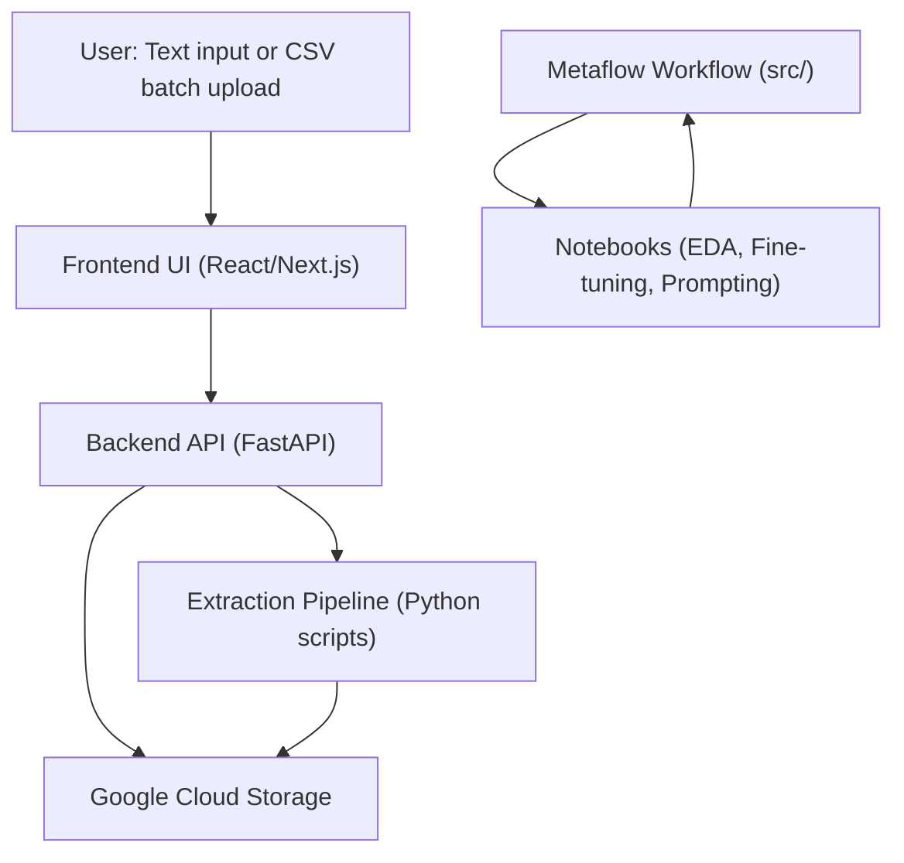

# Open Avenues Medical NLP Pipeline

## Overview

This project delivers a complete system for **Medical Named Entity Recognition (NER)** extraction from unstructured radiology reports. It includes:

- **Notebooks** for data exploration, model fine-tuning, and prompting experiments  
- A **Metaflow workflow** for orchestrating parallel experiments and comparing results  
- A **Backend (FastAPI) + Frontend (React/Next.js) application** for user interaction and real-time extraction serving  

---

## Motivation

Extracting structured clinical data from free-text reports accelerates medical research and improves healthcare workflows. This project harnesses advanced transformer models fine-tuned on domain-specific data and integrates them into a scalable, user-friendly pipeline.

---

## Project Components

### 1. Notebooks: EDA, Fine-tuning & Prompting

- **Exploratory Data Analysis (EDA):**  
  Initial inspection and processing of medical report data, including tokenization and label analysis.

- **Fine-tuning Solution:**  
  Training Bio_ClinicalBERT-based token classification models for accurate entity extraction.  
  **The fine-tuning notebook also uploads the trained model to Hugging Face Hub**, making it available for downstream use in the extraction pipeline.

- **Prompting Solution:**  
  Experimenting with few-shot prompting on large language models as an alternative extraction strategy.

These notebooks allow rapid development, experimentation, and evaluation of different approaches.

---

### 2. Pipeline & Metaflow Workflow (src/)

- Implements **parallel execution** of EDA, fine-tuning, and prompting experiments via **Metaflow**, enabling:  
  - Systematic orchestration of workflows  
  - Quantitative comparison of extraction results and confidence  
  - Experiment tracking and reproducibility

- Supports batch processing of medical reports and aggregates outputs for downstream use.

- The pipeline leverages the **fine-tuned model uploaded to Hugging Face** during experimentation for consistent and scalable inference.

---

### 3. Backend & Frontend Application

- **Backend (FastAPI):**  
  - Accepts single medical reports or CSV batches uploaded by users  
  - Uploads input data to Google Cloud Storage (GCS)  
  - Runs the core NLP extraction pipeline using the fine-tuned model from Hugging Face  
  - Returns structured extraction fields with confidence scores  
  - Uploads results back to GCS for persistence and auditing  

- **Frontend (React/Next.js):**  
  - Provides an intuitive UI for uploading reports or batch files  
  - Displays original report text alongside extracted entities and confidence  
  - Supports toggling between input and results view with navigation controls  

---

## Data Flow Diagram



## Installation and Running Guide

### Prerequisites

- Docker and Docker Compose installed (optional but recommended)  
- Python 3.8+ and Node.js 16+ if running locally without Docker  
- Google Cloud Storage bucket and service account JSON key  
- Hugging Face API token with access to your private model repository  

---

### Setup Secrets

Create a `secrets/` folder at the project root and place the following files inside:

- `gcp_key.json` — Your Google Cloud Storage service account key  
- `hugging_face_token.txt` — Your Hugging Face API token  

> **Note:** These files are **not** included in the repo for security reasons. Make sure to keep them safe.

---

### Running with Docker Compose (Recommended)

1. Clone the repository:

    ```bash
    git clone https://github.com/yourusername/yourrepo.git
    cd yourrepo
    ```

2. Create the `secrets/` folder and add your credentials files as described above.

3. Build and start containers:

    ```bash
    docker-compose up --build
    ```

4. Access the frontend at: [http://localhost:3000](http://localhost:3000)  
   The backend API will run on [http://localhost:8000](http://localhost:8000)

---

### Running Locally Without Docker

#### Backend

1. Create and activate a Python virtual environment:

    ```bash
    python3 -m venv venv
    source venv/bin/activate
    ```

2. Install backend dependencies:

    ```bash
    pip install -r backend/requirements_backend.txt
    ```

3. Export environment variables for credentials:

    ```bash
    export GOOGLE_APPLICATION_CREDENTIALS="/path/to/secrets/gcp_key.json"
    export HF_TOKEN="$(cat /path/to/secrets/hugging_face_token.txt)"
    ```

4. Run the FastAPI backend:

    ```bash
    uvicorn backend.main:app --reload
    ```

#### Frontend

1. Navigate to the frontend directory:

    ```bash
    cd frontend
    ```

2. Install dependencies:

    ```bash
    npm install
    ```

3. Run the frontend development server:

    ```bash
    npm run dev
    ```

4. Open your browser at [http://localhost:3000](http://localhost:3000)

---

### Notes

- Ensure your GCS credentials and Hugging Face token are valid and have appropriate permissions.  
- If running without Docker, open two terminal windows to run backend and frontend concurrently.  
- Adjust paths to your secrets files according to your local setup.

---

